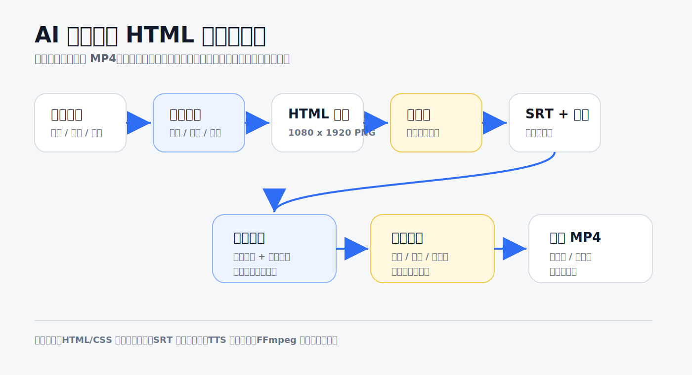
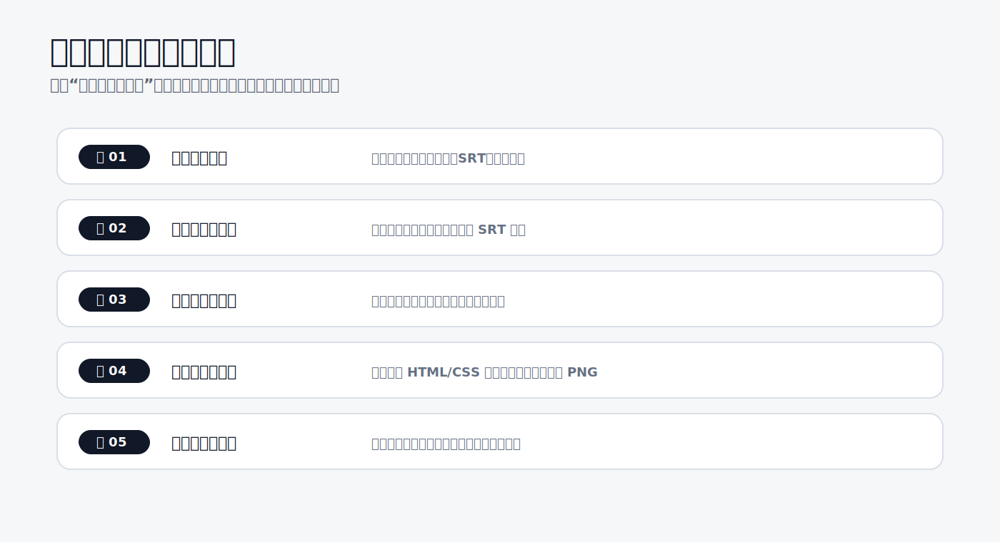
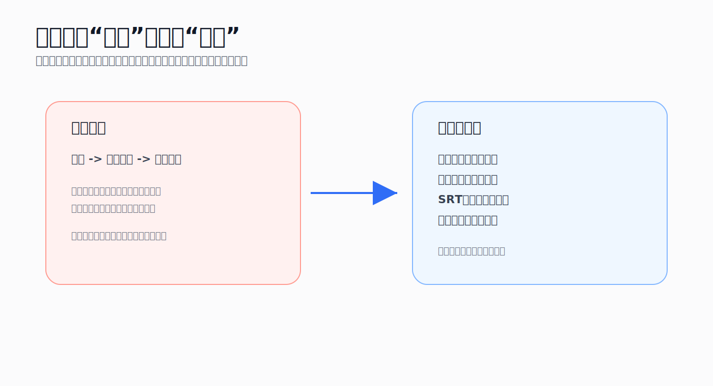
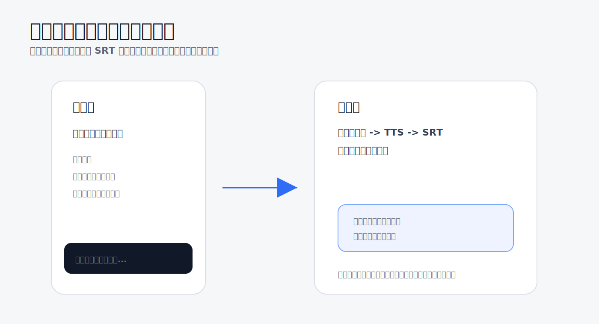
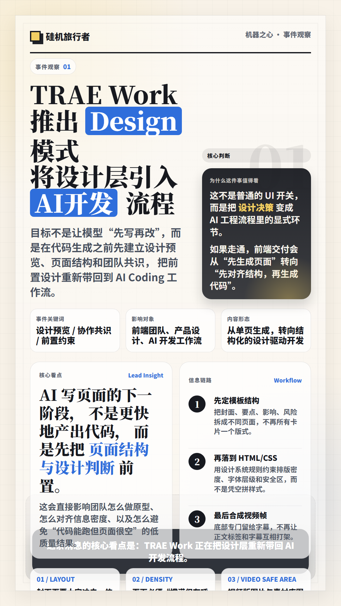
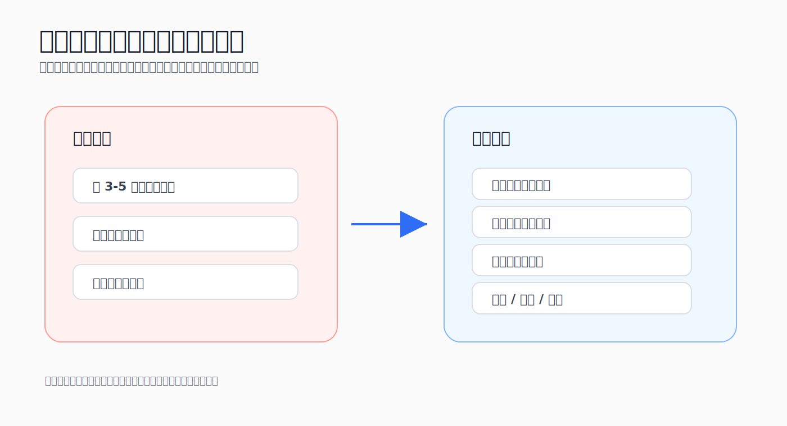
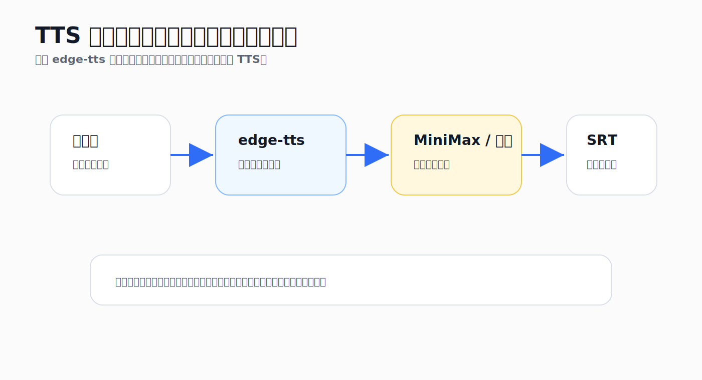
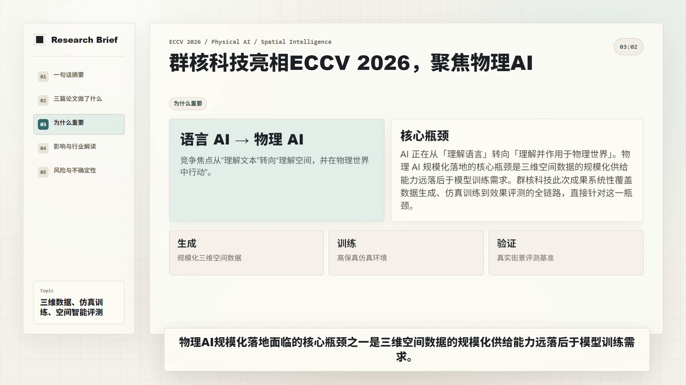
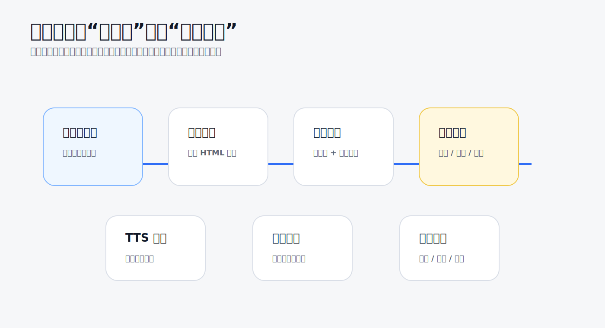

我最近在做一个 AI 资讯内容生产工作台。它的目标不是单纯生成一篇文章，而是把一条资讯从采集、过滤、改写、审核，一路推到可以复用的内容资产。

其中最让我反复调整的一段，是“从终稿自动生成竖屏视频”。

我最开始以为这个模块很简单：既然已经有终稿了，那就把正文拆成几张图片，再把图片拼成视频就好了。但真正做起来之后，我发现难点并不是“怎么合成 MP4”，而是怎么让文字、画面、字幕、配音和分镜各自站在正确的位置上。

最后我把这套流程整理成了下面这个结构：



```text
终稿内容
-> 结构化拆分
-> HTML/CSS 竖屏卡片
-> 新闻解读口播稿
-> TTS 配音
-> SRT 字幕
-> FFmpeg 合成竖屏 MP4
-> 视频质量检查
```

这篇文章不想只写“我做了什么功能”，而是更想记录这条工作流里踩过的坑，以及我后来找到的更稳的解决方案。

## 为什么我选择 HTML/CSS 做视频画面


传统剪辑软件当然可以做视频，但我想做的是高频、结构化、可复用的 AI 资讯解读。它和剧情视频、真人口播、广告片不太一样。

这类内容有几个特点：

- 文本结构比较清楚；
- 每条内容都需要标题、摘要、事实、影响、风险；
- 画面主要是辅助理解，不一定依赖实拍素材；
- 字幕必须和配音同步；
- 模板需要长期复用；
- 一条内容最好能同时产出文章、图文卡片和短视频。

如果每条都手动剪辑，成本会非常高。尤其是调整字幕、排版、每页画面停留时间这些工作，很容易变成重复劳动。

所以我选择把 HTML/CSS 当成视频画面的中间层。

它的好处是很直接的：

- HTML 适合表达结构；
- CSS 适合控制字体、留白、层级、卡片；
- 浏览器渲染比手写图片排版更稳定；
- 样式可以像前端组件一样复用；
- 后续可以把页面截图成 PNG，再用 FFmpeg 合成视频。

换句话说，我不是把 HTML 当网页，而是把它当成一套可编程的视频画布。

## 先看整体：这条工作流真正解决什么



这套流程的输入不是原始新闻，而是已经通过 AI 审核的终稿。也就是说，前面已经完成了资讯采集、过滤、初稿生成、自动审核和终稿入库。

视频模块接到的内容大概长这样：

```text
主标题
副标题
标签
一句话摘要
正文
多媒体线索
来源引用
风险提示
```

一开始我把它理解成“把这些字段塞进视频画面”。后来发现这个思路不对。

视频不是一个大号海报，它有时间。  
内容不是一次性展示给用户，而是随着口播一段一段出现。

所以更合理的拆法是：

```text
正文负责完整信息
口播稿负责讲述节奏
HTML 卡片负责每一屏重点
SRT 负责字幕时间
TTS 负责声音
FFmpeg 负责合成
```

这也是我后来反复调整后得到的核心经验：自动化视频不是把所有东西合在一起，而是把每一层拆清楚。

## 坑一：以为“生成图片”就等于“能做视频”



第一版我做得很直接：终稿进入终稿库后，系统自动生成几张竖屏图片，然后再把图片合成视频。

这听起来没问题，但实际效果很快暴露出问题。

图片只是静态素材。  
它没有口播节奏，没有时间轴，也不知道哪一句话应该对应哪一页画面。

更麻烦的是，如果我试图把更多正文放进图片里，图片本身就会变得越来越难看。用户看视频的时候，一页画面可能只停留 5 到 10 秒，如果上面塞了很多文字，根本读不完。

所以我后来把“图片”从最终表达降级成了“画面素材”。

新的拆法是：

```text
HTML 图片卡片：只表达当前页面的一个重点
口播稿：表达完整讲述
SRT 字幕：负责声音和文字的时间同步
分镜数据：决定每一页出现什么、停多久
```

这个调整很关键。  
它让图片不再承担所有信息，而是只负责视频画面里最该被看见的部分。

## 坑二：把字幕直接打在图片上，后面就很难做视频



我一开始也犯过一个很自然的错误：既然视频里要有字幕，那就在图片底部直接打一个字幕条。

这个做法很快就出问题了。

第一，图片上的字幕是死的。  
它不能根据配音时间变化，也不能精确对应当前口播。

第二，字幕长度不可控。  
一旦句子长一点，就会被截断、出现省略号，或者挤到画面正文上。

第三，图片正文和字幕会互相抢空间。  
图片本来就要承载标题和重点信息，如果底部再塞字幕，整个画面会很压。

我后来把字幕从图片里彻底拿掉，只在图片底部预留字幕安全区。

新流程变成：

```text
完整口播稿
-> TTS 配音
-> 根据口播生成 SRT
-> 视频合成阶段烧录字幕
```

这样做以后，图片和字幕的职责就分开了。

图片负责画面结构，字幕负责口播同步。  
如果字幕有问题，我只需要改 SRT 或口播稿，不需要重新设计图片。

这个改动对后续维护非常重要。因为视频字幕一定会频繁调整，如果字幕被写死在图片里，每一次修改都会牵动整个素材链路。

## 坑三：粗糙动效会让视频更差

<video controls playsinline preload="metadata" src="./assets/rough-motion-counterexample.mp4?v=bpl-shaky-motion" data-caption="早期粗糙动效反面教材：画面抖动、切入生硬，字幕和正文也会互相抢空间。"></video>

做视频时很容易有一个冲动：既然是视频，那就应该有动效。

我最开始也尝试过 zoompan、横移、推进、淡入淡出这些效果。技术上它们都能实现，但实际看起来并不好。

问题主要有几个：

- 画面会有轻微抖动；
- 有些元素从左侧切入，很像模板特效；
- 动效会抢走对内容本身的注意力；
- 如果每页都是同一种动效，反而显得廉价；
- 字幕和画面节奏稍微不一致，就会很别扭。

这让我意识到一个问题：第一版自动化视频最重要的不是“看起来很会动”，而是“看得清楚、听得明白、节奏稳定”。

所以我暂时关闭了粗糙的推进和横移动效，让视频按口播节奏正常翻页。

目前我的优先级是：

```text
字幕完整 > 声音同步 > 画面清楚 > 翻页稳定 > 动效丰富
```

动效不是不做，而是不能用不成熟的动效破坏基础观看体验。后续如果要加，也应该做成单独的动效合成层，并且配合质量检查，而不是在第一版里硬堆效果。

## 坑四：用 PIL 或纯代码排版，真的很容易不好看


一开始我尝试过更直接的图片生成方式：用代码把文字画到图片上。

它的好处是简单，后端直接生成 PNG，不需要太多前端能力。  
但问题也很明显：排版很难稳定。

只要标题稍微长一点，正文稍微多一点，或者某个关键词多几个字，整个画面就开始不协调。

典型问题包括：

- 标题换行不好看；
- 字体层级不稳定；
- 留白很难控制；
- 文本容易溢出；
- 一页内容多一点就开始拥挤；
- 不同卡片之间缺少统一视觉语言。

后来我决定把图文卡片改成 HTML/CSS 渲染。

新的逻辑是：

```text
终稿内容
-> 生成结构化卡片数据
-> 套入 HTML/CSS 模板
-> 浏览器渲染
-> 输出 1080 x 1920 PNG
```

这一步的价值很大。

HTML/CSS 本来就是为排版和响应式布局设计的。  
我们可以像做前端页面一样控制字号、网格、行高、留白、卡片层级和安全区。

更重要的是，模板可以沉淀。

当我发现某个模板不好看时，我不是去改一堆画图坐标，而是调整 CSS 结构。这样后面做多模板系统也更自然。

## 坑五：模板不能只追求“信息完整”



有一版模板，我为了避免画面中间太空，把标题、摘要、核心判断、影响对象、流程、关键词全塞进一张卡里。

当时的想法是：信息越完整，卡片越有价值。

但看完效果后，我发现这是另一个坑。

它的问题不是“信息不够”，而是信息太多了。  
一张卡里塞了太多层级，视频里用户根本来不及看。

这类模板更像杂志信息海报，不像短视频画面。静态看可能还行，但放进视频里就会变得压迫。

后来我重新定了视频卡片标准：

```text
一张卡只表达一个重点
标题最多承担主判断
摘要只保留一小段
辅助信息能删就删
底部留给字幕安全区
整组卡片靠分镜推进，不靠单张卡讲完所有内容
```

也就是说，视频卡片不需要把所有信息讲完。  
它只需要在当前 5 到 10 秒里，帮观众抓住一个重点。

这个标准比“信息完整”更适合视频。

## 坑六：分镜不能简单按字数或字幕数量切



视频合成里还有一个很容易被低估的问题：怎么切分镜。

最机械的做法是按字幕数量切，比如每 3 到 5 条字幕合并成一页。

这个方法实现很简单，但效果经常不自然。

因为字幕是声音的切片，而分镜是信息的组织方式。  
同一个观点可能被拆成两页，不同层级的信息也可能被塞进同一页。

比如一篇 AI 资讯通常会有这些结构：

```text
开场判断
事件背景
关键事实
影响对象
行业解读
风险提示
结尾总结
```

如果只是按字数切，页面很容易像自动分页。  
但如果按语义结构切，视频就更像“新闻解读”。

所以我现在更倾向于先按内容结构生成分镜，再结合口播时长调整每页停留时间。

第一版可以先固定为：

```text
开场
背景
关键事实
影响
风险
结尾
```

如果某篇文章没有足够内容，就不要硬凑 6 页。  
宁愿少一点，也不要为了数量牺牲质量。

这是我做图文卡片时也反复确认的一点：自动化不能等于机械补齐。

## 坑七：TTS 不是“有声音就行”



为了先跑通闭环，我第一版用了 edge-tts。它的好处是接入简单，可以快速生成中文配音。

但当视频开始真正可看之后，TTS 的问题就会变得明显：

- 口播稿不能太书面；
- 句子太长会影响听感；
- 字幕时间必须和声音匹配；
- 声音自然度会影响视频质感；
- TTS 失败时不能卡死整个流程；
- 后续可能需要替换成更高质量的商业 TTS。

所以我不想把 TTS 写死成某一个服务，而是把它做成适配器。

现在的策略是：

```text
第一版：edge-tts 跑通自动化闭环
后续：预留 MiniMax / 阿里 / 其他 TTS 接口
要求：失败可记录，音频和 SRT 可单独重生成
```

这里我觉得最重要的是“可替换”。  
因为 TTS 服务会变，价格会变，声音质量也会变。如果把整个视频流程绑定到某一个 TTS，后面维护会很痛苦。

更合理的方式是让视频模块只关心：

```text
输入：口播稿
输出：音频文件 + 字幕时间轴
```

至于背后是 edge-tts、MiniMax 还是阿里，都应该可以替换。

## 坑八：自动化不是不需要质量检查



当流程能自动跑通之后，另一个问题就出现了：系统可能自动生成一个“技术上成功，但体验上失败”的视频。

比如：

- 画面不是黑屏，但文字溢出了；
- 视频有声音，但字幕没对上；
- 文件生成成功，但时长明显不合理；
- 分辨率是对的，但画面被字幕遮挡；
- 某一页停留太短，用户来不及看。

所以我后来给视频阶段加了质量检查的思路。

第一版至少要检查：

```text
是否生成 MP4
是否有声音
是否有字幕文件
分辨率是否为 1080 x 1920
时长是否合理
是否能抽取质量检查帧
```

这些检查不能保证视频一定好看，但可以挡住很多明显错误。

更重要的是，它能让自动化流程更可控。  
如果某一步失败，系统应该记录失败原因，而不是静默生成一个有问题的结果。

## 成功的自动化 VS 失败的内容



回头看这套项目，我觉得最值得记录的一点是：我自动化成功的，其实是“流程”；但流程跑通以后，内容质量的问题反而暴露得更明显。

现在已经跑通的自动化链路大概是这样：

```text
1. 数据源维护：后台添加 RSS / 网页来源，并设置启停和抓取频率
2. 定时采集：自动抓取公开资讯，清洗正文并入库
3. 去重过滤：按 URL、标题相似度、正文相似度、发布时间、主题相关性做过滤
4. 初稿生成：过滤通过的资讯自动生成摘要、标题、副标题、正文和多媒体线索
5. 自动审核：AI 检查事实风险、结构完整度、营销味和机械感，不合格自动改写
6. 终稿入库：审核通过后自动进入终稿库
7. 图文素材：终稿入库后自动拆分分镜，生成 HTML/CSS 竖屏卡片
8. 视频前置：自动生成新闻解读口播稿、SRT 字幕和分镜数据
9. 视频合成：自动 TTS 配音，并用 FFmpeg 合成 1080 x 1920 MP4
10. 质量检查：检查文件、声音、字幕、分辨率、时长和关键帧
```

所以，如果只看工程流程，它已经不是一个“手动点几下”的工具，而是一条从资讯采集到视频产出的自动流水线。  
我只要维护数据源，后面大部分步骤都可以自动往下走。

但问题也在这里：自动化成功，不代表生成出来的内容就好。

这次踩坑里，失败的不是“系统不会生成”，而是“系统生成了，但效果不够好”：

- 资讯正文可以自动生成，但有时会偏模板化，像在套固定句式；
- 图文卡片可以自动生成，但早期排版很挤，留白、层级和阅读节奏都不好；
- 视频可以自动合成，但粗糙的 zoom、横移、推进动效反而让画面显得廉价；
- 分镜标签可以自动写出来，但不应该直接显示在视频画面里；
- 字幕可以自动烧录，但如果截断、省略或不同步，观感会立刻崩掉；
- TTS 可以自动配音，但声音自然度、断句和口播感还需要继续优化；
- 质量检查可以挡住黑屏、无声、没字幕，但还不能判断“好不好看”。

这也是我现在对这套工作流最清醒的判断：  
**成功的是自动化骨架，失败的是部分内容表现。**

所以后面不能只说“我做了一个自动生成视频的系统”。更准确的说法应该是：我搭出了一条 AI 资讯内容自动化流水线，并在这个过程中发现，真正难的不是把文件生成出来，而是让自动生成的内容达到可长期使用的标准。

这条流水线比较适合：

- AI 资讯解读；
- 行业事件观察；
- 产品更新说明；
- 报告摘要视频；
- 知识卡片型内容；
- 结构化观点输出。

它们的共同点是：内容本身有结构，画面主要帮助理解，而不是依赖复杂镜头语言。

它暂时不适合这些内容：

- 真人口播精剪；
- 强剧情视频；
- 情绪化广告片；
- 高度依赖实拍素材的视频；
- 需要大量复杂镜头调度的内容；
- 强依赖真实素材质感的内容。

接下来我更想优化的，不是“再多加几个自动步骤”，而是把已经自动化的步骤做得更像一个可交付的内容系统：模板更稳，字幕更准，口播更自然，视频素材更有信息量。

## 下一步我想继续优化什么


这条流程现在已经能跑通，但还远远不是最终形态。

我接下来最想继续优化几个方向。

第一，继续打磨 HTML/CSS 模板。  
目前模板已经从“代码画图”转向“网页式排版”，但真正好看的竖屏视频模板还需要继续迭代。尤其是标题长度、留白、字幕安全区、卡片数量这些细节，必须靠真实内容反复测试。

第二，增加多模板选择。  
不同内容不应该永远用同一种模板。AI 资讯、产品更新、数据报告、教程拆解，适合的视觉结构都不一样。

第三，升级 TTS。  
edge-tts 可以跑通第一版，但如果要发布给更多人看，声音质量很重要。后续我会把 MiniMax、阿里等 TTS 接口作为可替换方案继续调研。

第四，增加素材匹配层。  
现在画面主要由文字卡片组成，后续可以引入本地图片、公开图库或官网截图。但这个环节要谨慎，因为图片一旦不准确，就会误导观众。

第五，完善视频质量检查。  
自动化越强，越需要检查机制。否则系统只是更快地产出错误内容。

## 总结


回头看这段工作流，我最大的感受是：AI 视频自动化的难点，不是把图片拼成视频，也不是调用一个 TTS 接口。

真正难的是拆分职责。

图片不应该承担字幕的职责。  
字幕不应该被写死在图片里。  
动效不应该盖过内容。  
分镜不应该按字数硬切。  
TTS 不应该和主流程绑定死。  
自动化也不应该跳过质量检查。

当这些层次拆清楚以后，视频生成就不再是一堆临时脚本，而是一条可以持续迭代的内容生产流水线。

这也是我现在更确定的方向：先让流程稳定，再让模板变好看，再让声音和动效升级。

自动化内容生产不是一步到位，而是一层一层把不稳定的地方变成可控模块。
