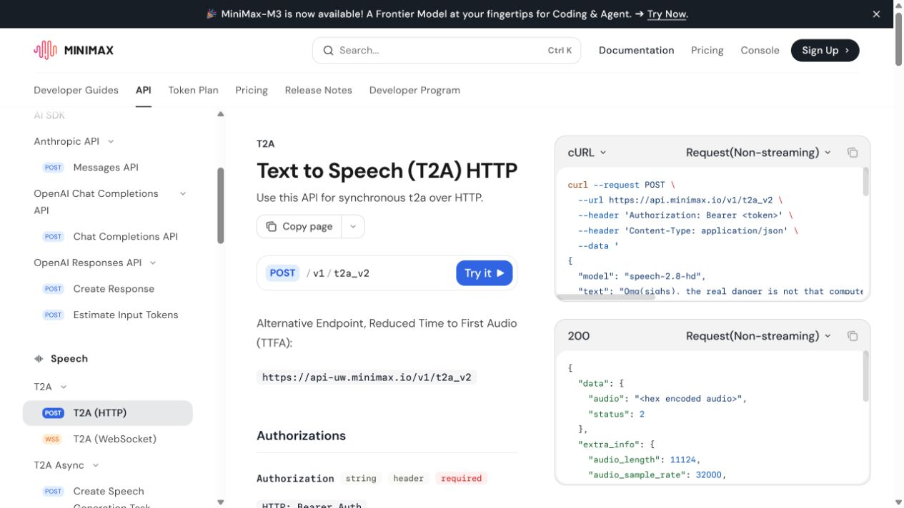

我最近做了一个小项目：输入一段完整文案，自动生成一条带配音、字幕和画面的知识讲解视频。

它不是用传统剪辑软件做的，也不是把图片拼成幻灯片，而是把 HTML/CSS/JS 当成视频画布，再用 HyperFrames 渲染成 MP4。整个流程大概是：

```text
文案
-> TTS 配音
-> SRT 字幕
-> 智能分镜
-> HTML 视频模板
-> HyperFrames 渲染 visual.mp4
-> FFmpeg 合成 final.mp4
```

最终目标很简单：以后我只想给一段文案，系统就能自动产出一个可以预览、可以修改、可以发布的视频。

## 为什么不用传统剪辑流程

我想做的主要是 AI 资讯、行业事件解读、知识讲解这类内容。它们有几个共同特点：

- 文案结构比较清晰；
- 画面主要承载信息，不一定需要真人素材；
- 字幕必须和配音严格同步；
- 模板复用价值很高；
- 产出频率可能比单条视频的精修程度更重要。

如果每条都手动剪辑，成本会很高。尤其是配字幕、卡点、排版、调整每一页画面，很容易消耗大量重复劳动。

所以我更想要的是一个“可编程的视频流水线”：文案是输入，HTML 是画布，分镜是中间结构，视频只是最终渲染结果。

## 输入和输出

这个工作流目前的输入可以分成三类。

第一类是核心内容：

```text
script.txt
```

也就是完整视频文案。

第二类是由系统自动生成的中间文件：

```text
voice.wav
captions.srt
storyboard-rule.json
storyboard-llm.json
storyboard-compare.json
```

其中 `voice.wav` 是 TTS 配音，`captions.srt` 是字幕文件，`storyboard` 是视频分镜。

第三类是模板配置：

```text
template-config.json
HTML / CSS / JS 模板
```

最终输出两个视频：

```text
visual.mp4
final.mp4
```

`visual.mp4` 是无声画面，`final.mp4` 是把画面和配音合成后的最终视频。

这样做的一个好处是：画面和声音可以分开调试。画面有问题就只重渲 visual，配音有问题就只重跑 TTS，不需要每次从头做完整流程。

## 工作流拆解

目前完整流程是这样的：

```text
1. 输入文案
2. 调用 MiniMax TTS 生成配音
3. 根据配音生成 SRT 字幕
4. 解析 SRT 为结构化字幕 JSON
5. 生成规则版分镜
6. 生成 LLM 版分镜
7. 输出分镜对比报告
8. 用 HTML/CSS/JS 生成视频模板
9. HyperFrames 渲染无声视频
10. FFmpeg 合成最终视频
```

这里的 TTS 环节用的是 MiniMax 的 Text to Speech API，对应官方文档里的 T2A HTTP 接口。截图只放公开文档页，不涉及控制台、账号信息或 API key。



这里最关键的并不是 TTS，也不是渲染，而是“分镜”。

因为如果分镜不好，后面模板做得再漂亮，也只是把一堆内容硬塞进页面里。

## 最开始的分镜问题

一开始我用的是很机械的办法：每 3 到 5 条字幕合并成一个场景。

这个方法实现很简单，也比较稳定，但效果很快就暴露出问题。

字幕不是分镜。字幕是声音的切片，而分镜是信息的组织方式。

比如一段资讯稿里可能有这些结构：

```text
事件内容
为什么重要
影响对象
行业解读
风险/不确定性
```

如果只是按字幕数量切，很可能会把同一个观点拆成两页，也可能把两个不同层级的内容塞到一页。画面看起来就会很机械，像自动分页，而不是视频分镜。

我后来把分镜改成了两套并行方案。

第一套是规则分镜。

它会识别文案里的结构标题，比如“事件内容：”“为什么重要：”“影响对象：”等，然后按语义章节切页。优点是稳定、便宜、可控。

第二套是 LLM 分镜。

它会读取完整文案结构和字幕时间，尝试生成更像人工编辑的页面结构。比如把“影响对象”和“行业解读”合并成一页，把过长的“事件内容”压缩成更适合展示的页面。

为了避免大模型一上来就改坏最终结果，我没有让它自动覆盖最终 storyboard，而是先生成两个候选文件：

```text
storyboard-rule.json
storyboard-llm.json
```

然后再生成一个对比报告：

```text
storyboard-compare.json
```

目前阶段只是提示哪一个分数更高，但仍然需要人工确认。

这个设计很重要。自动化不应该一开始就追求“全自动覆盖”，尤其是内容生产这种主观性比较强的环节。先生成候选，再做对比，能降低很多不可控风险。

## HTML 为什么适合做这类视频

我这次没有用 React，只用了普通 HTML/CSS/JS。

原因是视频画面本质上是一个确定时间点的视觉状态。对这个需求来说，HTML 已经足够表达：

- 标题；
- 卡片；
- 列表；
- 网格；
- 标签；
- 引用块；
- 底部字幕；
- 页面转场；
- 进场动画。

CSS 负责排版和视觉风格，JS 负责根据当前时间找到当前场景和字幕，GSAP 负责可 seek 的动画。

这里有一个硬要求：动画必须能 seek。

也就是说，视频在任意时间点都要能准确还原画面，不能依赖用户点击、滚动、鼠标事件，也不能依赖 `setTimeout` 这种一次性时间逻辑。

最终的 timeline 逻辑大概是：

```text
当前时间
-> 找当前 scene
-> 找当前 caption
-> 根据 scene start/end 计算进度
-> 控制页面入场、停留、转场
-> 底部字幕按 SRT 严格显示
```

这也是为什么我觉得 HTML 视频适合知识类内容。它不是在模拟剪辑软件，而是把视频拆成一组可编程的状态。

## 模板风格：从科技感到 Notion 风格

最开始我想做的是高级科技感：黑色背景、蓝紫渐变、玻璃拟态、发布会式排版。

但实际测试后，我发现对知识讲解来说，过强的科技风会抢内容的注意力。

后来我换成了 Notion 风格：

- 米白或浅灰背景；
- 干净卡片；
- 标题常驻顶部；
- 左侧目录显示当前分镜；
- 正文区域突出关键信息；
- 底部固定字幕；
- 少用强渐变和装饰效果。

这个风格更适合教程、资讯拆解和知识点讲解。它的优势不是“炫”，而是稳定、清楚、可复用。

对我来说，这比做一个很酷但难以长期复用的模板更有价值。

## 一个实际测试：群核科技物理 AI 资讯

我用一段关于群核科技 ECCV 2026 论文入选的文案做了测试。

> 测试文案节选：在欧洲计算机视觉顶级会议 ECCV 2026 上，群核科技共有三篇论文入选，聚焦物理 AI 关键领域。其一，联合 Adobe、NVIDIA、Apple、Intel 等机构提出 SPEAR——下一代面向物理 AI 的高保真仿真平台；其二，提出面向强化学习的数据自进化框架 Syn-GRPO；其三，推出基于真实街景的交互式空间智能评测基准 WalkerBench。
>
> 为什么重要：当前 AI 发展正从理解语言转向理解并作用于物理世界。物理 AI 规模化落地面临的核心瓶颈之一，是三维空间数据的规模化供给能力远落后于模型训练需求。
>
> 风险/不确定性：SPEAR 等仿真平台的实际性能与通用性、Syn-GRPO 自动生成数据的质量边界，以及 WalkerBench 暴露出的空间导航能力差距，都还需要更多独立验证。

这段文案大约 950 字，内容包括：

- 事件内容；
- 为什么重要；
- 影响对象；
- 行业解读；
- 风险/不确定性。

TTS 生成后，音频大约 181 秒，SRT 一共 28 条字幕。

规则分镜生成了 6 页：

```text
1. 事件内容 1
2. 事件内容 2
3. 为什么重要
4. 影响对象
5. 行业解读
6. 风险/不确定性
```

LLM 分镜生成了 5 页：

```text
1. 一句话摘要
2. 三篇论文做了什么
3. 为什么重要
4. 影响与行业解读
5. 风险与不确定性
```

对比下来，LLM 版更像真正的视频讲解结构。它没有简单照搬文案标题，而是把“影响对象”和“行业解读”合并成了一个更自然的页面。

最终我用 LLM 分镜生成了一个 5 页视频：

```text
visual.mp4
final.mp4
```

画面是浅色 Notion 风格，左侧是分镜目录，右侧是当前内容页，底部是同步字幕。


## 踩过的坑

这个流程看起来顺，但中间其实踩了不少坑。

第一个坑是 MiniMax 的接口域名。

我一开始用的是 OpenAI-compatible 的默认域名，结果 LLM 接口返回 401。后来发现 `.env` 里的 TTS endpoint 走的是 `api.minimaxi.com`，于是 LLM endpoint 也需要从这个域名推导。修完以后，同一个 key 就可以复用到 TTS 和大模型分镜。

第二个坑是编码。

前面有一次数据文件出现过乱码。对中文视频来说，编码问题非常致命，因为一旦 `script.txt` 或 `captions.srt` 坏掉，后面的分镜、字幕、画面都会跟着坏。后来我把流程统一成 UTF-8，并且在渲染前检查 `render-data.js` 里的中文是否正常。

第三个坑是分镜不能只看字幕数量。

按 3 到 5 条字幕切页看似合理，但一旦遇到长句、并列结构或章节结构，就会显得很机械。真正要优化的是“信息组织”，不是“字幕平均分配”。

第四个坑是渲染速度。

3 分钟左右的视频，HyperFrames 渲染会花几分钟。它不是不能接受，但需要在流程上区分“快速预览”和“最终渲染”。否则每改一次小细节都完整渲染，会很浪费时间。

第五个坑是文字溢出。

HTML 做视频很方便，但也很容易出现文字超出卡片、字幕挡住正文、标题过长等问题。HyperFrames 的 `lint` 和 `inspect` 很有用，可以在渲染前发现布局问题。

## 这个工作流适合什么

目前我觉得它很适合这些内容：

- AI 资讯解读；
- 行业事件拆解；
- 产品更新说明；
- 教程步骤讲解；
- 知识点总结；
- 数据报告型短视频。

它们的共同点是：信息结构清楚，画面主要是辅助理解，而不是依赖复杂素材。

它暂时不适合这些内容：

- 强剧情视频；
- 真人口播剪辑；
- 高度依赖素材镜头的视频；
- 情绪化广告片；
- 需要复杂镜头语言的内容。

这套流程的优势是稳定和复用，不是替代所有视频生产方式。

## 我接下来想继续做什么

现在这套流程已经能从文案生成完整视频，但还不是最终形态。

下一步我想继续优化几个方向。

第一，自动选择更好的分镜。

目前规则版和 LLM 版都会生成，也会打分，但不会自动覆盖最终 storyboard。等测试样本多一些后，可以让系统在明确条件下自动选择更好的版本。

第二，增加更多模板。

Notion 风格适合知识讲解，但不是所有内容都适合这个风格。后面可以继续做：

- 科技发布会风；
- 数据报告风；
- 竖屏短视频风；
- 教程步骤风；
- 产品更新风。

第三，加入图片和资料图。

目前画面主要由文字和卡片组成。后续可以根据内容自动生成或检索配图，但这一步需要更谨慎，因为图片一旦不准确，就会误导观众。

第四，把图文博客和视频流程打通。

同一段内容可以同时生成：

- 博客文章；
- 图文卡片；
- 短视频；
- 视频字幕；
- 分镜脚本。

这样内容不再是单一格式，而是一套可复用的内容资产。

## 总结

这次项目让我更确定了一件事：知识类视频不一定非要从剪辑软件开始。

如果内容结构清楚，HTML 就可以成为一个很好的视频画布。TTS 负责声音，SRT 负责同步，智能分镜负责信息组织，HyperFrames 负责渲染，FFmpeg 负责合成。

真正难的不是“把画面渲染成 MP4”，而是把一段文案拆成适合观看的视觉结构。

也就是说，视频自动化的核心不是生成更多动画，而是让信息在正确的时间，以正确的层级出现。

这也是我接下来会继续优化的方向。
