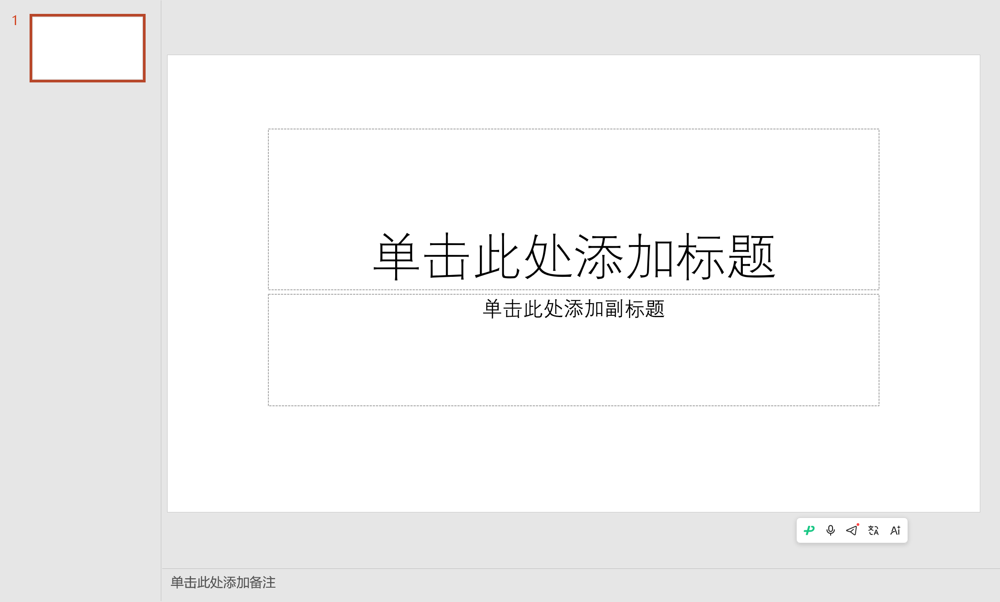
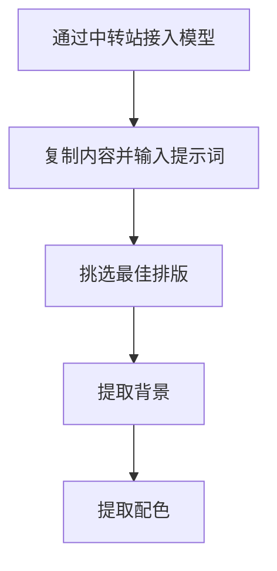
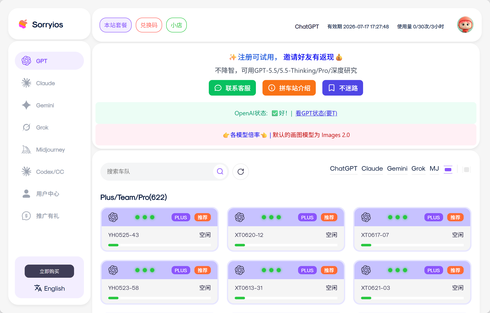

# 📊 内容自主可控的AI辅助PPT工作流

> 用顶级生图模型排版，减少排版内耗时间

## 🎯 核心理念

当前市面上没有任何一款软件能够同时做好以下四个环节，且每个效果都达到优秀：

- **分页设计**
- **资料收集**
- **PPT生成**
- **PPT美化**

因此，本方案将四个环节拆解，利用AI工具辅助每个环节，实现**内容完全自主可控**的高质量PPT制作。

### 💡 四大核心理念

| 理念 | 说明 |
|------|------|
| **内容大于形式** | 一个内容完全可控的PPT比花哨模板更重要 |
| **资料自己手动收集整理** | 确保数据准确、逻辑严密 |
| **用顶级生图模型来排版** | 减少排版内耗时间 |
| **背景统一后整体视觉一致性自然形成** | 提升整体质感 |

---

## 🚀 六步法全流程


### 第一步：确定主题 + AI生成分页脚本 📝

这是整个流程的起点，决定了PPT的结构和逻辑。

#### 操作流程

1. **明确汇报主题**（如：某某项目进展汇报）
2. **确定页数要求**（如：10-15页）
3. **将主题和页数要求输入AI大模型**（ChatGPT / Claude / 文心一言等）
4. **AI生成逐页脚本**，包含每页标题和核心内容要点
5. **人工审核脚本**，调整逻辑、补充遗漏、删除冗余

#### 输出格式示例

```markdown
第1页：封面 - 项目概述
第2页：背景介绍 - 行业现状与痛点
第3页：目标设定 - SMART原则
...
```

---

### 第二步：新建PPT + 简单填充内容 💻

拿到分页脚本后，快速搭建PPT骨架。

#### 操作步骤

1. 新建空白PPT（PowerPoint / WPS均可）
2. 按照脚本的页数，**批量新建对应数量的空白幻灯片**
3. 将每页的标题和核心内容文字**填入对应幻灯片**
4. 此阶段**不追求美化**，只需保证内容位置正确

#### 关键原则

> ✅ **快速填充，不做美化** —— 节约时间
> ✅ **每页结构清晰**：标题在上，内容在下
> ✅ **预留图片、表格的位置**（用占位文本框标记）

#### 效果示例



> 📌 上图为新建空白PPT后的初始状态，后续只需按步骤填充内容即可。

---

### 第三步：收集资料 📚

这是确保内容质量的核心环节，需要**手动完成**。

#### 资料类型

| 类型 | 说明 | 示例 |
|------|------|------|
| **文字资料** | 行业报告、论文、新闻 | 引用数据、案例 |
| **图片资料** | 产品图、场景图、图表 | 增强视觉效果 |
| **表格数据** | Excel、CSV、数据库导出 | 支撑论证 |

#### 关键原则

> 📌 **宁多勿少** —— 多收集备用，后期筛选  
> 📌 **标注来源** —— 便于引用和查证  
> 📌 **分类存放** —— 按页面编号建立文件夹

---

### 第四步：生图模型排版（核心环节）🎨

这是本方案最具创新性的步骤——**用顶级AI生图模型来做PPT排版设计**，而非依赖PPT模板。

#### 为什么要用生图模型？

| 优势 | 说明 |
|------|------|
| **顶级审美** | 顶级模型（如ChatGPT image generation、Midjourney等）的排版审美远超人工调整 |
| **高效对比** | 一次生成5种不同排版，对比选择，效率极高 |
| **避免模板化** | "AI味不要太重" —— 这个提示词约束很重要 |

#### 操作流程



##### 步骤A：通过中转站接入模型

由于国内网络限制，需要使用中转站服务来访问ChatGPT image generation等顶级生图模型，无需翻墙。

> 💡 **常见中转站**：各类API代理服务（可根据实际情况选择）

#### 中转站示例



> 📌 上图为常见的AI API中转站界面，通过此类平台可便捷地访问ChatGPT、Claude、Midjourney等顶级生图模型，无需翻墙。

##### 步骤B：复制内容并输入提示词

将PPT中已填充好的文字内容复制到生图工具中，然后输入以下提示词模板：

```plaintext
请将以下内容设计为一个专业的PPT页面排版：

【内容】
（粘贴你的PPT页面内容）

【要求】
- 采用现代简约风格
- 信息层次清晰
- 配色专业且不花哨
- AI味不要太重
- 生成5个不同版本的排版供选择

【输出】
5张排版设计图
```

##### 步骤C：挑选最佳排版

从生成的5张图中，对比**排版布局、色彩搭配、信息层次**，选出最合适的一张。

##### 步骤D：提取背景

选定排版后，对AI说：

> "请把这张图的背景提取出来给我。"

这样**整个PPT的背景就统一确定了**。

##### 步骤E：提取配色

选择一个AI做的好的图片，对AI说：

> "请把这张图的文字配色提取出来给我。"

这个**文字的配色方案就确定了**。

---

### 第五步：复刻到PPT 🔄

将选定的排版图片转化为**可编辑的PPT格式**。有两种方案可选：

#### 方案A：SVG矢量转换

1. 将AI生成的排版图片转换为SVG矢量格式
2. 导入PPT后取消组合，转换为可编辑对象
3. 手动调整细节

#### 方案B：智能体复刻（推荐）✅

使用AI智能体（如ChatGPT、Claude等）辅助复刻：

1. 将排版图片发送给AI智能体
2. 要求："请将这个排版设计复刻为PPT格式，保持布局和配色"
3. AI生成PPT文件或提供详细制作步骤
4. 手动微调细节

> **推荐理由**：效率高，还原度好，适合快速迭代

---

### 第六步：最终合成 ✨

将前面所有环节的产出**整合为成品PPT**。

#### 合成步骤

1. **新建PPT**，将提取的背景图片设置为**幻灯片母版背景**
2. **复制智能体输出的PPT内容**，粘贴到对应页面
3. 将之前收集的**文字、图片、表格逐页填充**
4. **微调位置、字号、行距等细节**
5. **检查所有页面的视觉一致性**

#### 关键检查清单 ✅

| 检查项 | 说明 |
|--------|------|
| **所有页面背景统一** | 确保视觉一致性 |
| **标题层级一致** | 字号、颜色、位置 |
| **数据来源标注完整** | 便于查证 |
| **图片清晰度达标** | 避免模糊 |
| **翻页动画统一** | 提升专业感 |

---

## 📊 方案对比：传统方式 vs 本方案

| 对比维度 | 传统方式 | 本方案 |
|----------|----------|--------|
| **内容可控性** | 依赖模板，内容受限 | ✅ 完全自主可控 |
| **排版质量** | 依赖个人审美 | ✅ 顶级AI模型辅助 |
| **资料收集** | 可能遗漏 | ✅ 手动收集，确保准确 |
| **效率** | 低（反复调整） | ✅ 高（AI辅助） |
| **视觉效果** | 模板化 | ✅ 定制化 |

---

## 🗺️ 完整六步流程图


---

## 🎯 适用场景

本方案适用于**任何需要高质量PPT的场合**：

- 📚 课程汇报
- 🎓 毕业答辩
- 💼 项目路演
- 📊 工作总结
- 🔬 学术报告

---

## 🔗 参考资料

- ChatGPT 官方文档：https://platform.openai.com/docs
- Midjourney 使用指南：https://docs.midjourney.com
- 中转站链接：https://sorryios.ai/

---

**📅 最后更新**：2026年6月22日
