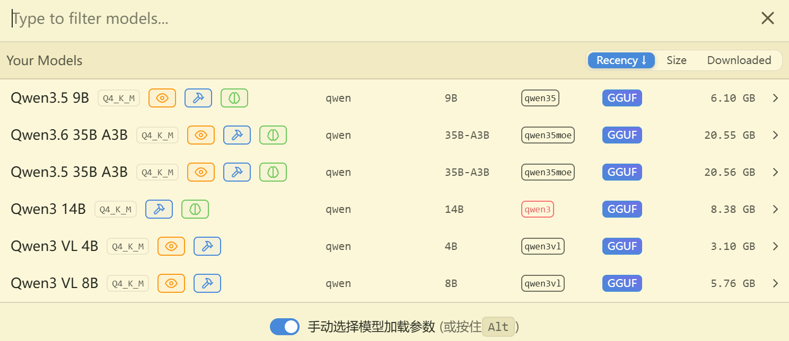
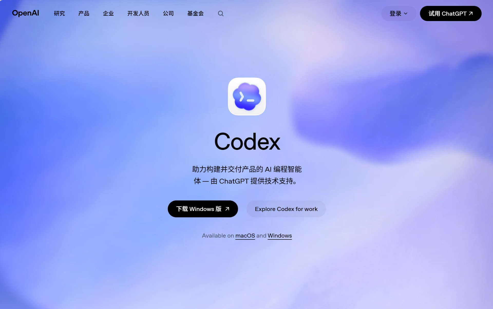

# 我和 QwenPaw 的 50 天：一个 AI 助手的使用复盘

> 配置地狱、功能缺失与最终逃离——一个真实的使用者视角

## 前言

2026 年 4 月 24 日，我在本地部署了 QwenPaw，期待它能成为我的 AI 工作伙伴。

2026 年 5 月中旬，我彻底放弃了它，转向了 Codex。

这中间发生了什么？为什么一个看起来功能强大的本地 AI 助手，会在短短 20 天后被抛弃？

这篇文章，是我对这 50 天使用历程的完整复盘。

---

## 一、缘起：为什么选择 QwenPaw

### 初始动机

选择 QwenPaw 的原因很简单：

1. **隐私保护**：数据留在本地，不走云端
2. **成本控制**：不用按 token 付费
3. **可控性**：可以自己配置模型、工具、工作流

### 硬件环境

我的电脑配置：

- **CPU**：AMD Ryzen AI 9 H 365
- **内存**：32GB DDR5
- **显卡**：Vega 集成显卡
- **存储**：足够的 SSD 空间

这个配置看起来不错，但集显成了后来的性能瓶颈。

### 第一次对话

2026 年 4 月 24 日 16:21，我打开了 QwenPaw，问了第一个问题：

> "你用的什么模型？"

这是我和 QwenPaw 的第一次接触。当时，我对它的期望很高。

---

## 二、探索期：工具链搭建（4 月下旬 ~ 5 月初）

### 硬件摸底

2026 年 4 月 27 日，我让 QwenPaw 帮我查电脑配置。

结果显示：

- CPU 是 AMD Ryzen AI 系列，有 NPU
- 内存 32GB，足够跑本地模型
- 显卡是 Vega 集显，性能有限

这次摸底让我意识到：我的硬件适合跑小模型，不适合大模型推理。

### 本地模型部署

我通过 LM Studio 部署了 Qwen 系列模型：

**遇到的问题：**

1. **LM Studio 路径依赖**：安装后移动目录，导致 QwenPaw 找不到模型
2. **模型格式问题**：需要下载 GGUF 格式，其他格式不支持
3. **内存占用高**：跑 7B 模型就占用了 20GB+ 内存

**解决方案：**

- 固定 LM Studio 安装路径
- 只下载 GGUF 格式的量化模型
- 接受性能限制，只用小模型



### 语音输入集成

我集成了 Whisper tiny.en 模型，用于语音转文字：

**收获：**

- Whisper CLI 可以直接处理 WAV 文件，不需要 ffmpeg
- tiny.en 模型速度快，但准确度一般
- 语音输入适合快速记录想法

**问题：**

- 中文识别效果不好
- 需要手动启动语音录制
- 没有自动降噪功能

### 图片理解

大多数国产模型没有图片理解功能，但图片理解又是必须的功能，所以我为一些文本模型接入了 MiniMax API，用于图片理解，也算是一种曲线救国：

**配置过程：**

1. 注册 MiniMax 账号
2. 获取 API Key
3. 在 QwenPaw 中配置 API Key
4. 测试图片上传和理解功能

**体验：**

- 图片理解效果不错
- API 调用有延迟
- 需要联网，不符合本地部署初衷


*其实 M2.7 版本一个月 29 块钱性价比很高的，根本用不完。*

---

## 三、工作流形成：从工具到系统（5 月）

### 文档生成工作流

2026 年 4 月 30 日，我让 QwenPaw 帮我建立文档生成工作流：

**工作流程：**

```
Markdown → pandoc → docx → LibreOffice → PDF
```

**遇到的问题：**

1. **docx-js 的 bug**：生成空段落
2. **样式丢失**：从 Markdown 转 docx 时，样式不完整
3. **PDF 转换慢**：LibreOffice 转换大文件很慢

**解决方案：**

- 永远在段落里加 TextRun
- 用 `pageBreakBefore` 控制分页
- 接受转换速度，优化模板

**收获：**

- 建立了完整的文档生成流程
- 可以批量生成行业报告
- 文档质量达到可用水平

### 行业报告轮询系统

2026 年 5 月 13 日，我让 QwenPaw 帮我建立行业报告轮询系统：

**系统功能：**

1. 基于 GB/T 4754-2017 标准，覆盖 96 个行业大类
2. 每天 11:10 自动轮询
3. 多渠道搜索（艾瑞、CBNData、36Kr 等）
4. 自动生成报告封面和摘要

**配置过程：**

1. 创建 Cron 定时任务
2. 配置搜索渠道优先级
3. 设置报告输出格式
4. 测试轮询逻辑

**完成进度：**

- 完成了 0-18 索引（19 个大类）
- 生成了部分报告封面
- 积累了搜索经验

**问题：**

- 搜索结果质量不稳定
- 某些渠道需要登录
- 报告生成速度慢

### MCP 工具集成

我尝试集成了多个 MCP 工具：

**已配置的工具：**

1. Excel：处理表格数据
2. Firecrawl：网页抓取
3. Docx：文档生成
4. 抖音：内容分析
5. 高德地图：地理位置
6. Bing 搜索：联网搜索

**配置复杂度：**

- 每个工具都需要单独配置
- API Key 管理混乱
- 某些工具配置后无法使用

**体验：**

- 工具集成是 QwenPaw 的亮点
- 但配置过程不够友好
- 工具之间的协作不够流畅

> 其实无论是 MCP 还是 Skill，这些外部的链接不应该让用户自己配置，而是 Agent 在处理任务时自己自动发现并主动配置，然后再告知用户。自由配置，看似自由，对于小白来说，却是门槛。

---

## 四、问题积累：从希望到失望

### 配置问题的具体表现

#### 1. 联网搜索配置地狱

**最头疼的一次配置：**

我想让 QwenPaw 具备联网搜索能力。按照文档，需要配置：

1. Bing Search API Key
2. Firecrawl API Key
3. 多个搜索渠道的优先级

**配置过程：**

1. 注册 Bing Search API，获取 Key
2. 配置到 QwenPaw 的 `config.json`
3. 测试搜索功能
4. 发现搜索结果不稳定
5. 重新配置，调整优先级
6. 还是不稳定

**问题根源：**

- API Key 配置后，QwenPaw 没有验证机制
- 搜索结果质量依赖多个因素（API 配额、网络环境、搜索渠道）
- 错误信息不够明确，难以排查

**最终解决：**

- 放弃 Bing Search，改用 Firecrawl
- 接受搜索结果不稳定的现实
- 手动验证搜索结果

#### 2. 登录验证的噩梦

**反复出现的问题：**

每次重启 QwenPaw，某些需要登录的功能就会失效：

**具体表现：**

1. 抖音登录 Cookie 过期
2. 腾讯文档登录状态丢失
3. 某些 MCP 工具需要重新授权

**尝试的解决方案：**

1. 手动备份 Cookie
2. 配置自动登录
3. 延长 Cookie 有效期

**问题根源：**

- QwenPaw 的浏览器用户数据目录占用空间大（1.81 GB）
- Cookie 管理不够智能
- 某些网站的登录机制复杂（验证码、二次验证）

**最终解决：**

- 放弃需要登录的功能
- 只用不需要登录的工具
- 接受功能受限的现实

#### 3. 其他配置问题

**环境配置复杂：**

- LM Studio 路径依赖，移动后失效
- Python 包版本冲突
- Node.js 包全局安装污染系统

**依赖管理问题：**

- 虚拟环境配置繁琐
- 某些包需要编译，Windows 上容易失败
- 依赖版本不兼容

**记忆系统不可靠：**

- 实时索引为空（`memory_chunks.jsonl` 是空文件）
- 需要手动备份记忆
- 对话记录管理不够完善

### 功能不全的具体表现

#### 1. 最缺失的功能：操控电脑

**我需要但 QwenPaw 没有的功能：**

直接操控电脑的能力，比如：

- 打开应用程序
- 操作文件管理器
- 控制鼠标和键盘
- 自动化桌面任务

**为什么需要这个功能？**

很多人或许会觉得操控电脑是件可有可无的事情，但实际上情况完全不一样。

纯文本模型使用命令来操控电脑，这种命令必须是接口齐全、认证齐全的，并且操控页面对人类很不友好。

如果能够操控电脑，那就是模仿人的视觉来进行，弥补了单一命令行的不足，两者互补，99%的任务都可以胜任，那才是真的省心！

**QwenPaw 的局限：**

- 只能通过 MCP 工具间接操作
- 某些操作需要手动干预
- 无法真正"操控"电脑

#### 2. 现有功能不够稳定

**联网搜索不稳定：**

- 搜索结果质量波动大
- 某些渠道需要登录
- API 配额限制

**文档生成不够稳定：**

- docx-js 有 bug
- 样式丢失
- 转换速度慢

**MCP 工具不够稳定：**

- 某些工具配置后无法使用
- 工具之间的协作不够流畅
- 错误处理不够智能

#### 3. 没有自己的模型

**为什么这是个问题？**

QwenPaw 本身不提供模型，需要用户自己部署：

**问题：**

1. **本地部署**：性能不够（集显限制）
2. **云端 API**：成本不可控，隐私泄露
3. **模型选择**：需要自己判断哪个模型适合

**我的困境：**

- 本地模型性能不够，不敢给它复杂任务
- 云端 API 成本高，不敢频繁使用
- 某些复杂任务（比如长文档分析），我不敢交给 QwenPaw

**结果：**

- QwenPaw 只能做简单任务
- 复杂任务还是我自己做
- AI 助手的价值大打折扣


*阿里的 Coding Plan 套餐很贵，且千问模型并不好用。*

---

## 五、为什么抛弃 QwenPaw

### 抛弃时间

2026 年 5 月中旬

### 直接原因

长久的问题积累，导致彻底失望。

### 5.1 配置问题的最后一根稻草

**最后一根稻草：Codex 的出现**

2026 年 5 月中旬，我听说了 Codex。

一开始，我只是想试试看。但当我看到 Codex 的演示时，我意识到：

> "这才是我需要的 AI 助手。"

**对比：**

| 功能 | QwenPaw | Codex |
|------|---------|-------|
| **配置复杂度** | 高（需要手动配置多个工具） | 低（开箱即用） |
| **功能完整性** | 中（缺少关键功能） | 高（功能强大） |
| **稳定性** | 低（很多问题） | 高（开箱即用） |
| **性能** | 低（集显限制） | 高（云端算力） |

**决定：** 放弃 QwenPaw，转向 Codex。

### 5.2 替代方案：Codex

**为什么选择 Codex？**

1. **功能强大**：具备操控电脑的能力
2. **开箱即用**：不需要复杂配置
3. **稳定性高**：功能稳定，不易出错
4. **性能强大**：云端算力，响应快



**Codex 的优势：**

| 方面 | QwenPaw | Codex |
|------|---------|-------|
| **配置** | 复杂，需要手动配置多个工具 | 简单，开箱即用 |
| **功能** | 不全，缺少关键功能 | 强大，功能完整 |
| **性能** | 低，集显限制 | 高，云端算力 |
| **稳定性** | 低，很多问题 | 高，功能稳定 |
| **模型** | 无，需要自己部署 | 有，内置强大模型 |

**迁移过程：**

很顺利。

1. 安装 Codex
2. 配置基本设置
3. 测试功能
4. 完成迁移

**没有遇到大问题。**

### 5.3 抛弃后的反思

**不是 QwenPaw 不好，是不适合。**

QwenPaw 有自己的优势：

1. 隐私保护好（数据本地）
2. 成本控制好（不按 token 付费）
3. 可控性高（可以自己配置）

但对我来说，这些优势不足以抵消它的劣势：

1. 配置太复杂
2. 功能不够全
3. 稳定性不够高

**每个工具都有适用场景。**

QwenPaw 适合：

1. 对隐私要求高的用户
2. 有耐心配置的用户
3. 硬件条件好的用户（独显 + 大内存）

Codex 适合：

1. 需要强大功能的用户
2. 希望开箱即用的用户
3. 愿意为性能付费的用户

**选择工具要考虑实际需求。**

我需要的是：

1. 强大功能（操控电脑）
2. 开箱即用（不需要复杂配置）
3. 稳定性能（不容易出错）

Codex 满足这些需求，QwenPaw 不满足。

所以，我选择了 Codex。

---

## 六、复盘与建议

### 关键数据

- **使用周期**：约 20 天（2026-04-24 ~ 2026-05-中旬）
- **对话次数**：约 10 次（前期活跃，后期减少）
- **行业报告**：完成 19 个大类
- **工具集成**：尝试了 6+ 个 MCP 服务
- **配置时间**：累计 10+ 小时
- **解决问题**：累计 5+ 个

### 收获

1. **AI 助手的价值在于工作流集成，不只是聊天**
   - QwenPaw 的 MCP 工具集成是亮点
   - 但工具之间的协作不够流畅

2. **本地部署有隐私优势，但性能和配置是瓶颈**
   - 数据本地，隐私保护好
   - 但性能受硬件限制，配置复杂度高

3. **工具链比模型性能更重要**
   - 模型性能再强，工具链不行，也用不好
   - QwenPaw 的模型选择灵活，但工具链不够完善

4. **配置复杂度直接影响使用体验**
   - QwenPaw 的配置太复杂，消耗耐心
   - Codex 的开箱即用，体验好太多

5. **功能完整性是长期使用的关键**
   - QwenPaw 缺少关键功能（操控电脑）
   - Codex 功能完整，满足需求

### 给后来者的建议

#### 1. 在选择前

**明确自己的需求：**

- 你需要哪些功能？
- 你能接受多复杂的配置？
- 你的硬件条件如何？

**评估配置能力：**

- 你能解决复杂配置问题吗？
- 你愿意花时间学习吗？
- 你能接受反复出错吗？

**考虑硬件限制：**

- 集显还是独显？
- 内存够不够？
- 硬盘空间够不够？

#### 2. 在使用中

**及时记录配置问题：**

- 记录每次配置的过程
- 记录每次出错的原因
- 记录每次解决的方法

**定期备份重要数据：**

- 备份对话记录
- 备份配置文件
- 备份记忆文件

**不要勉强使用不适合的工具：**

- 如果配置太复杂，考虑换工具
- 如果功能不够全，考虑换工具
- 如果使用体验差，考虑换工具

#### 3. 在放弃时

**总结经验，帮助他人：**

- 写下你的使用历程
- 记录你的问题和解决方案
- 分享你的经验和教训

**选择合适替代方案：**

- 明确你的需求
- 对比不同工具
- 选择最适合的

**保持开放心态：**

- 没有最好的工具，只有最适合的工具
- 尝试不同的工具
- 找到最适合自己的

---

## 结语

2026 年 4 月 24 日，我开始使用 QwenPaw。

2026 年 5 月中旬，我放弃了它。

这 20 天，我学到了很多：

1. AI 助手不是聊天工具，是工作流集成平台
2. 本地部署有优势，但也有瓶颈
3. 配置复杂度直接影响使用体验
4. 功能完整性是长期使用的关键
5. 选择工具要考虑实际需求

现在，我使用 Codex，工作效率大大提升。

但我不后悔使用 QwenPaw。

因为，正是这段经历，让我明白了自己真正需要什么。

---

**如果你正在考虑使用 QwenPaw，希望这篇文章能帮你做出更明智的决定。**

**如果你已经在使用 QwenPaw，希望这篇文章能帮你解决一些问题。**

**如果你已经放弃了 QwenPaw，欢迎分享你的故事。**

---

**写于 2026 年 6 月 24 日**

**作者：小范**

---

## 附录：QwenPaw 使用时间线

| 日期 | 事件 | 说明 |
|------|------|------|
| 2026-04-24 | 第一次对话 | "你用的什么模型？" |
| 2026-04-25 | 第二个工作区 | QwenPaw_QA_Agent_0.2 |
| 2026-04-27 | 硬件摸底 | 查电脑配置 |
| 2026-04-30 | 文档生成工作流 | Markdown → docx → PDF |
| 2026-05-07 | 翻译文件 | 中英文翻译 |
| 2026-05-08 | 生成图片 | 图片生成任务 |
| 2026-05-09 | 食品检测市场 | 行业研究 |
| 2026-05-13 | 定时任务 | Cron 配置 |
| 2026-05-13 | 行业报告助手 | 工作流形成 |
| 2026-05-15 | 微信集成 | 多渠道对话 |
| 2026-05-24 | 代理连接问题 | 网络配置 |
| 2026-06-01 | 获取桌面地址 | 文件路径问题 |
| 2026-06-05 | Codex 下载 | 准备迁移 |
| 2026-06-14 | 最后一次对话 | 查找 Codex 文件夹 |
