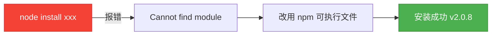
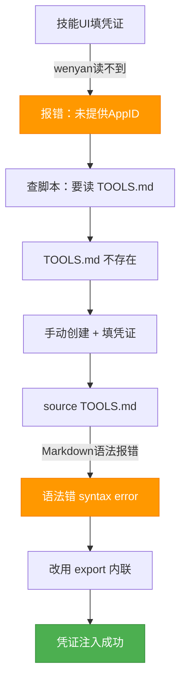
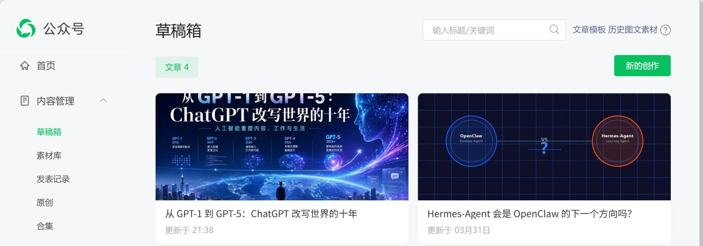

# 用 WorkBuddy 把文章发进公众号草稿箱：踩了 5 个坑的实战记录

> 本以为一条命令搞定，结果踩了五个坑。这篇文章记录全过程。

## 前言

前几天我想发一篇 ChatGPT 发展史的公众号文章，顺手用 WorkBuddy 这个 AI 助手来做——从选题、查资料、写正文，到最后同步到草稿箱，一条龙。

听起来很美好对吧？我以为也是。结果从开写到文章真正躺进草稿箱，中间踩了五个坑：wenyan-cli 装不上、凭证读不到、source 报语法错、IP 不在白名单……

这中间发生了什么？为什么一个看起来"一键发布"的技能，会卡这么多次？

这篇文章是我对整个流程的完整复盘。如果你也想用 WorkBuddy（或类似工具）把 Markdown 文章发进公众号草稿箱，这篇能帮你少走至少四个弯路。

---

## 一、起点：选题、写作与一个被放弃的方案

任务很简单：写一篇 ChatGPT 发展史，同步到公众号草稿箱，署名"范三千"。

### 史实核实

第一步不是写，是查。AI 写历史类文章最大的风险就是"编"——把年份搞错、把产品张冠李戴。所以我没有直接让模型写，而是先做了多源核实：

- **OpenAI 官方博客**：一手发布日期与官方表述
- **Reuters / The Verge**：增长数据与宫斗风波的权威报道
- **第三方时间线站点**（ai-news-today、scriptbyai）：版本迭代与能力跃迁的交叉核对

三个来源互相印证，有冲突的以官方为准。比如 GPT Store 和 ChatGPT Team 的发布时间，部分中文资料标在 2023 年初，但官方记录是 2024 年 1 月——这种小错最容易混进文章里，必须抠掉。

### 一个被放弃的方案：爱范儿 HTML 模板

我手上有一套爱范儿风格的 HTML 排版模板，主色 `#FF5722`（橙），有漂亮的引用块、提示框、装饰分割线。我原本想让 AI 套着这个模板写。

结果发现一个尴尬的事实：**Wechat Publisher 技能的底层是 wenyan-cli，它只吃 Markdown，不吃 HTML。**

也就是说，我的 HTML 模板在这里派不上用场。wenyan 会用自己的主题（比如 lapis 青金石主题）来渲染 Markdown，生成公众号格式的正文。

所以最终我生成了两个版本：

- `chatgpt-history.html`：爱范儿风格，留作备份和别处用
- `chatgpt-history.md`：带 wenyan 要求的 frontmatter（title + cover），走技能流程

> 教训：选工具前先搞清楚它的输入格式。HTML 模板再好看，工具不认也是白搭。

---

## 二、第一个坑：wenyan-cli 怎么都装不上

Wechat Publisher 技能基于 wenyan-cli，得先全局安装。技能文档里写的是：

```bash
npm install -g @wenyan-md/cli
```

但我用的是 WorkBuddy 自带的 managed Node.js（隔离环境，不污染系统），路径是：

```
C:\ProgramData\WorkBuddy\users\d28092d\.workbuddy\binaries\node\versions\22.22.2\
```

第一次我直接跑 `node install -g @wenyan-md/cli`，结果报错：

```
Error: Cannot find module 'D:\...\install'
```

**坑点**：`node install xxx` 不等于 `npm install xxx`。`node` 后面跟的应该是一个 JS 文件，`install` 不是文件名，所以它当成模块去找，找不到就崩了。正确做法是用 `npm` 这个可执行文件，而不是 `node`。

第二次我找到 managed node 目录下的 `npm`，跑：

```bash
"C:\...\node\versions\22.22.2\npm" install -g @wenyan-md/cli
```

这次成功了，268 个包装上，wenyan 版本 2.0.8。



> 教训：managed node 环境里，别用 `node install`，要用同目录下的 `npm` 可执行文件。

---

## 三、第二个坑：凭证配置的三重脱节

wenyan-cli 要调用微信 API，得有 AppID 和 AppSecret。我在 WorkBuddy 的技能配置界面里填了这两个值，以为就完事了。

结果第一次跑 wenyan，报错：

```
未提供 AppID：请通过参数、环境变量或配置文件指定。
```

**坑点一**：技能配置 UI 里填的凭证，wenyan 根本读不到。翻技能的 `setup.sh` 脚本才发现，它实际是从一个叫 `TOOLS.md` 的文件里读凭证的：

```bash
TOOLS_MD="$HOME/.openclaw/workspace/TOOLS.md"
WECHAT_APP_ID=$(grep "export WECHAT_APP_ID=" "$TOOLS_MD" | ...)
```

但这个文件在我的 Windows 环境下压根不存在——`.openclaw` 目录都没创建。技能 UI 和脚本读取路径是脱节的。

**解决方案**：手动创建这个文件，写入凭证：

```bash
# TOOLS.md 内容
export WECHAT_APP_ID=wxXXXXXXXXXXXXXX
export WECHAT_APP_SECRET=XXXXXXXXXXXXXXXXXXXXXXXXXXXXXXXX
```

**坑点二**：我想用 `source TOOLS.md` 把凭证加载进环境变量，结果报语法错：

```
TOOLS.md: line 9: syntax error near unexpected token `('
```

原因：TOOLS.md 是 Markdown 文件，里面有 `> 1. 登录 [微信公众平台](https://...)` 这样的 Markdown 语法，`source` 把它当 shell 脚本执行，遇到括号和方括号就崩了。

**解决方案**：不 source，直接在命令里 export：

```bash
export WECHAT_APP_ID=wxXXXXXXXXXXXXXX
export WECHAT_APP_SECRET=XXXXXXXXXXXXXXXXXXXXXXXXXXXXXXXX
wenyan publish -f article.md -t lapis -h solarized-light
```

一条命令搞定，凭证随命令注入，不依赖 source。



> 教训：技能 UI 的配置和脚本实际读取的路径可能不是一回事，得翻脚本源码才能确认。Markdown 文件不能 source，老老实实用 export。

---

## 四、第三个坑：IP 白名单

凭证解决了，满怀信心再跑一次。这次 wenyan 真的连上微信 API 了，但返回：

```
40164: invalid ip 203.0.113.xxx, not in whitelist rid: xxxxxxxx
```

**这就是 IP 白名单问题。** 微信公众平台要求所有调用 API 的服务器 IP 都必须在白名单里，否则拒绝访问。

**坑点**：我不知道自己的出口 IP 是多少。问 AI 助手，它说它也测不准——因为它运行在云端动态调度环境，出口 IP 随时可能变，而且 WebFetch 这类工具走的是代理层，测出来的 IP 不一定是 wenyan 实际调用时走的 IP。

**解决方案**：不要瞎猜，让微信自己告诉你。上面那个报错里的 `203.0.113.xxx` 就是 wenyan 实际调用的真实出口 IP。这是唯一可靠的来源。

把它加到公众号后台的白名单里就行：

1. 登录 [微信公众平台](https://mp.weixin.qq.com/)
2. 设置与开发 → 基本配置 → IP 白名单 → 修改
3. 把报错里的 IP 加进去，保存

加完重跑，成功。

> 教训：出口 IP 不要自己测，从 40164 报错里读。这是微信官方也推荐的"按报错配置"做法。

---

## 五、成功：那一刻的截图

最后一次运行，wenyan 返回：

```
[Proxy] Global fetch proxy enabled: http://127.0.0.1:7892
发布成功，Media ID: SvDuT0XLnqA70OtcIBjY5a9fqa5wvl3QoTTDjrpk0MT_8C7UkwqG307BeDcZ7HA3
```

打开公众号后台，草稿箱里躺着那篇《从 GPT-1 到 GPT-5》。



> 草稿箱里文章已就位，封面图、正文排版（lapis 主题 + solarized-light 代码高亮）都正常。接下来在后台确认一下摘要和封面，就能发布了。

---

## 六、报错对照表 + 发公众号前 Checklist

把这一路踩的坑整理成速查表，方便下次（也方便你）。

### 报错对照表

| 报错信息 | 根因 | 解法 |
|---------|------|------|
| `Cannot find module 'install'` | 误用 `node install xxx` | 改用 `npm install -g xxx` |
| `未提供 AppID` | 凭证未注入环境变量 | `export` 后再跑 wenyan |
| `syntax error near unexpected token` | `source TOOLS.md` 遇到 Markdown 语法 | 手动 export，不 source |
| `40164: invalid ip xxx, not in whitelist` | 出口 IP 不在白名单 | 把报错里的 IP 加进公众号白名单 |

### 发公众号前 Checklist

- [ ] 文章 Markdown 顶部有 frontmatter（`title` + `cover` 必填）
- [ ] 封面图放在文章同目录，路径写对
- [ ] wenyan-cli 已安装（`wenyan --version` 能跑通）
- [ ] AppID 和 AppSecret 已 export 进环境变量
- [ ] 公众号后台 IP 白名单已加出口 IP
- [ ] 系统代理可用（wenyan 默认走 `127.0.0.1:7892`）

---

## 结尾

回顾整个过程，从开写到草稿箱成功，大概花了一小时——其中写作十分钟，踩坑五十分钟。

这其实挺典型的。AI 工具的"一键发布"听着美好，但真跑起来，配置地狱、路径脱节、网络白名单这些工程问题，一个都绕不过去。WorkBuddy 的 Wechat Publisher 技能本身设计得不错，问题主要出在技能 UI 和底层脚本的衔接上——UI 填的凭证脚本读不到，这是最该改进的地方。

> 工具的成熟，往往不在它最好的时候，而在它最难用的时候还有人愿意用。

下次再发公众号，这五个坑我应该一个都不会再踩了。希望这篇能帮你也少踩几个。

---

## 参考资料

- wenyan-cli GitHub：https://github.com/caol64/wenyan-cli
- wenyan 官网：https://wenyan.yuzhi.tech
- 微信公众号 API 文档：https://developers.weixin.qq.com/doc/offiaccount/
- WorkBuddy 官网：https://www.codebuddy.cn

---

**📅 最后更新**：2026年6月26日
